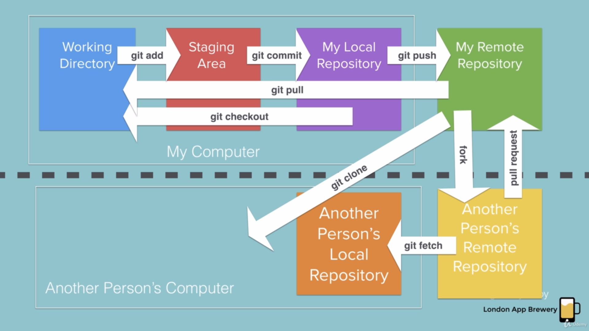

<p align="center">

</p>


<h1 align="center"> Hacktoberfest 2022 </h1>


<p align="center">

</p>

## About Hacktoberfest and Open-Source Contribution
Hacktoberfest is DigitalOcean’s annual event that encourages people to contribute to open-source throughout October. Everyone can contribute to open-source whether a tech person or a non-tech person. One can contribute to documentation, improve the source code, add some elements to UI/UX, debug some erroneous code and more things you can do to the existing projects. You can also put your projects and make the repository public to available as open-source. Open-source means that the source code is open for all, everyone can read it, make changes and improve it and collab in the project after reviewing by the maintainer of the project. Hacktoberfest is all about giving back to the projects, sharpening skills, and diving into the open-source community.

## Programmers Hub
 
This is an open-source repository to basically solve any real life problems or any coding-related problem using your programming skills. You can use any language to code and contribute it here, we welcome you all to contribute and enjoy.

That's it not gonna bore you all. Just contribute while enjoying.


## Contribution Guidelines


<p align="right">

</p>

Step 1: Fork the repo
- Click on the "Fork" button on the top right corner. You'll be redirected to your github account.

Step 2: Initialize a repo
- Open GitBash and type the following command:
```
git init
```

Step 3: Clone the repo
- Click on the green button ``` Code ``` on the top of the repo and copy the url of the repo
- Type the following command:  
```
git clone <url>
````
- Paste the url in the command that you copied and press enter
- Now, the repo is cloned in your local environment

Step 4: Create a seperate branch
- Type the following command in the GitBash
```
git checkout -b <branch-name>
```
- It is recommended to keep the branch name same as your GitHub username
 
 
Step 5: Edit in your local environment
- Now, the repo is normally like a folder in your pc.
- Add, modify or delete any file or do changes in the existing file in your favourite code editor.
- When you are done with the changes, then go to next steps.

Step 6: Add changes to the branch
- Type the following command in GitBash
```
git add .
```
- This command will add all the changes into the branch.

Step 7: Commit your changes
- Commiting the changes ensures that now the file or code is ready from your side to be added in the project.
- Type the following command in GitBash
```
git commit -m "<your-name> message"
```
- The message is necessary to execute the commit command.

Step 8: Publish your branch to remote repo
- Now, it's time to publish your ready branch, with updates into the remote repo that is on GitHub.
```
git push origin <your-branch-name>
```


Step 9: Create Pull Request
- When you visit the forked repository you will see compare and pull request button.
- Click it and leave a description about changes for the better understanding.

Congratulations!! You have made your pull request

Now, the maintainer of the repo will review your changes and merge your pull request to the project repo.
If there are any issues with your pull request, the maintainer will comment and tag you requesting the correction.

### Now you are ready to go with Hacktoberfest !
 
## 🔗 Connect With Us
[](https://gdsc.community.dev/maharaja-surajmal-institute-of-technology-delhi/)
[](https://in.linkedin.com/company/dsc-msit-delhi-google-developer-student-clubs)
[](https://discord.gg/AXPNerez)
